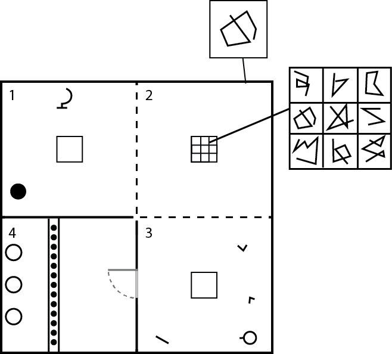

# VR_Game_MEP
Simple VR Prototype Game - "4 Light"

# Developement Platform
Unity 2019.1.14f1

Operating System: Windows

IDE: Visual Studio

Target Platform: Windows - Oculus Rift

# Description 
Das Projekt ist ein VR Prototyp, welches auf grundlegenden VR Interaktionen, wie Objekte nehmen, zusammenbauen und werfen basiert. Das Ziele des Spielers ist es den Raum auszuleuchten. Um das zu erreichen muss er in 4 verschiedenen Bereichen eins Raumes jeweils ein Rätsel lösen. Jedes Rätsel macht die Umgebung ein Stück heller.

# Tasks

In Progress:

o Andere Assests hinzufügen: Ambient Sound, Taschenlampe Sound 

o Skript für das ein- und ausschalten der Taschenlampe erstellen(+Sound) 

Done:

o Git Repository erstellen 

o Unity Projekt erstellen & pushen 

o Grey box von Raum in Unity erstellen 

o Benötigte Assests suchen: Globus, Taschenlampe, Basketballkorb + Ball, Schlüssel, Textur für Wand + Boden 

o Skript für Zusammenbau feature allgemein erstellen 

o Skript an verschiedene Objekte anpassen 

o Zeichen Auswahl Skript für 2. Raum erstellen 

o Skript für Tür erstellen

o Skript für Basketballkorb 

Removed:

o Skript für Helligkeit erstellen  

# Skizze

# Issues

Teleportation didn't work because of the haptic feedback was deleted in the Steam VR Input Settings.

# Resources

Symbols for the second Puzzle were created by freepik - www.freepik.com

3D Assets - www.free3d.com and www.turbosquid.com

Textures - www.3dtextures.me
